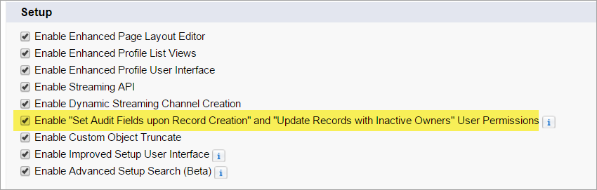
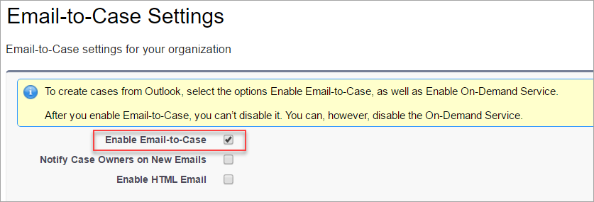
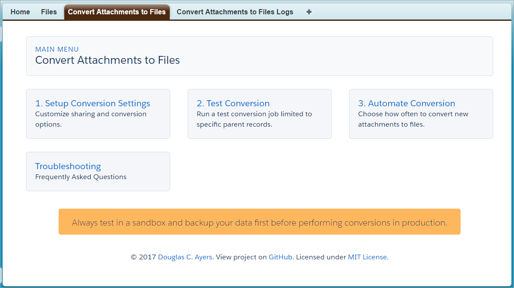
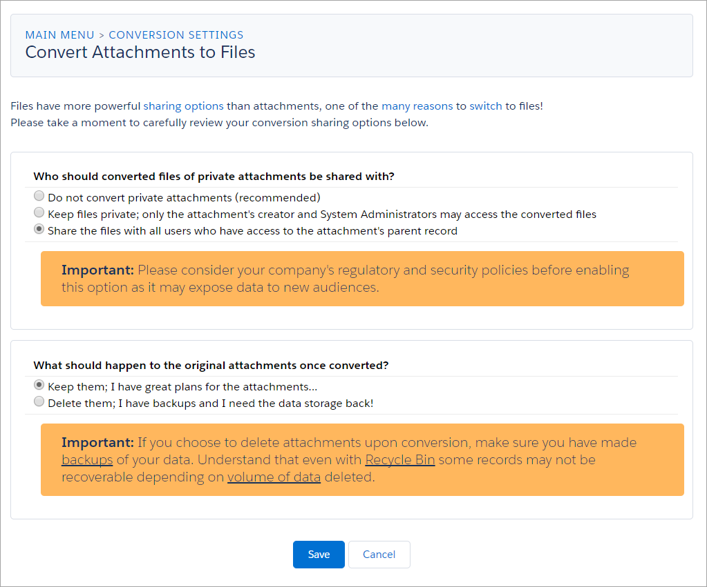
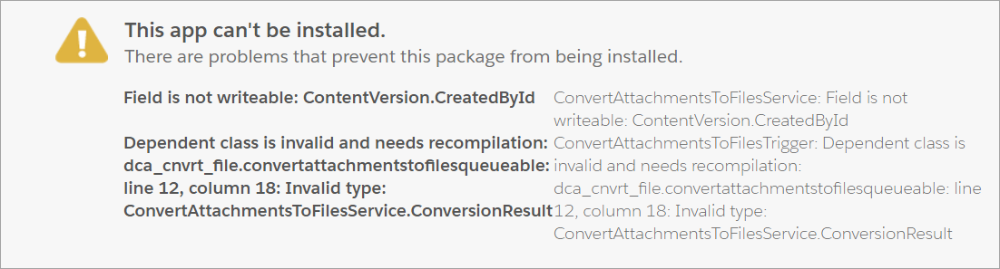

Convert Attachments to Salesforce Files
=======================================

Overview
--------

Salesforce [announced](https://releasenotes.docs.salesforce.com/en-us/spring17/release-notes/rn_files_add_related_list_to_page_layouts.htm) that after **Winter '18**
the "Notes & Attachments" related list will no longer have an upload or attach button. Customers will be required to migrate to and adopt Salesforce Files.

At the time of this project in 2015, Salesforce had not yet provided an official conversion tool from Attachments to Files.
In the [Summer '17 release](https://releasenotes.docs.salesforce.com/en-us/summer17/release-notes/rn_files_attachments_to_files.htm), Salesforce Labs [released their own app via the AppExchange](https://appexchange.salesforce.com/listingDetail?listingId=a0N3A00000EHAmyUAH).

This project enables the manual or automatic conversion of classic [Attachments](https://developer.salesforce.com/docs/atlas.en-us.api.meta/api/sforce_api_objects_attachment.htm)
into [Salesforce Files](https://developer.salesforce.com/docs/atlas.en-us.api.meta/api/sforce_api_objects_contentversion.htm)
to take advantage of more sophisticated features, like sharing, revisions, larger file sizes, etc.

The package includes visualforce pages that let you:
* Configure sharing and conversion options
* Run test conversions
* Enable near real-time or scheduled conversions

Additional Background:
* [Why You Should Add the Files Related List to Your Page Layouts](https://releasenotes.docs.salesforce.com/en-us/spring17/release-notes/rn_files_add_related_list_to_page_layouts.htm)
* [Add the Files Related List to Page Layouts](http://docs.releasenotes.salesforce.com/en-us/winter16/release-notes/rn_chatter_files_related_list.htm)
* [5 Reasons to Use Files Related List](https://admin.salesforce.com/5-reasons-use-files-related-list)
* [Chatter Files: A Better Option for Attaching Files to Records](https://www.salesforce.com/blog/2012/04/chatter-files-a-better-option-for-attaching-files-to-records.html)
* [ContentVersion Documentation](https://developer.salesforce.com/docs/atlas.en-us.api.meta/api/sforce_api_objects_contentversion.htm)

Pre-Requisites
--------------

* Enable [Create Audit Fields](https://help.salesforce.com/articleView?id=000213290&type=1&language=en_US) so Attachment create/update/owner fields can be preserved on the new files

* Enable [Email-to-Case](https://help.salesforce.com/articleView?id=customizesupport_ondemand_email_to_case.htm). You don't have to begin using it, just have it enabled. The code references the `EmailMessage` object.

Packaged Release History
------------------------

Release 1.3 (latest)
-----------
* Install package
  * [Production URL](https://login.salesforce.com/packaging/installPackage.apexp?p0=04t46000001Zcme)
  * [Sandbox URL](https://test.salesforce.com/packaging/installPackage.apexp?p0=04t46000001Zcme)
* Adds support for "Guest Site" users creating attachments when the near real-time trigger option is enabled. [Issue 32])(https://github.com/DouglasCAyers/sfdc-convert-attachments-to-chatter-files/issues/32)
* Adds option to specify "Max Records to Convert" for customers who have more attachments to convert than the daily allowed Content Publication Limit. This allows those admins to better plan multi-day conversions. [Issue 17](https://github.com/DouglasCAyers/sfdc-convert-attachments-to-chatter-files/issues/17)
* New with Winter '18, **private** attachments are converted and shared to parent record using new [File Privacy on Records](https://releasenotes.docs.salesforce.com/en-us/winter18/release-notes/rn_files_on_records.htm) field.
* Updated all code to API v41.0 (Winter '18)

Release 1.2
-----------
* Preserves `LastModifiedDate` from original attachment. [Issue 26](https://github.com/DouglasCAyers/sfdc-convert-attachments-to-chatter-files/issues/26) 
* Report on conversion results to know how many and which attachments were converted, failed, or skipped. [Issue 22](https://github.com/DouglasCAyers/sfdc-convert-attachments-to-chatter-files/issues/22) 

Please note, this app always preserved the original `CreatedDate` of the converted attachment but the `LastModifiedDate` was always "today"
because of how the new File was being shared to the parent record. In my original design I had opted to give you all more options around how
the newly converted File gets shared to internal and community users as well as whether users with access to the parent entity inherited
read-only or edit access to the file. But those options came at the cost of never being able to preserve the original `LastModifiedDate`.

Responding to your all's feedback and use cases, this version of the app now preserves the `LastModifiedDate` of the original attachment!
However, to make this possible means the app no longer manually shares the new File by explicitly creating `ContentDocumentLink` records.
This has the side effect that two previously available conversion settings have now been removed:
  * **Which community of users who have access to the attachment's parent record get access to the converted files?**
  * **How should view or edit access to the converted file be granted to users with access to the attachment's parent record?**

These options now rely on the Salesforce defaults which as of the the Summer '17 release are:
  * Historical attachments are shared with **InternalUsers**
  * New attachments created by Community Users that get auto-converted by this app's trigger are shared with **AllUsers**
  * The new Files are read-only to users with access to the parent entity, the owner of the file must explicitly change the file's sharing to give other users edit access

Release 1.1
-----------
* Fixes inconsistency when detecting if a file has already been converted or not due to special access rules on ContentVersion object. [Issue 19](https://github.com/DouglasCAyers/sfdc-convert-attachments-to-chatter-files/issues/19)
* If error log records are generated then email is sent to all Salesforce Users listed in `Setup | Email Administration | Apex Exception Email` notifying them to review the error log records.

Release 1.0
-----------
* Initial managed package offering
* Split out Notes Conversion into its [own project](https://github.com/DouglasCAyers/sfdc-convert-notes-to-chatter-notes)

Installing the Source Code (Developers)
---------------------------------------

You may install the unmanaged code from GitHub and make any desired adjustments. You are responsible for ensuring unit tests meet your org's validation rules and other requirements.

* [Deploy from Github](https://githubsfdeploy.herokuapp.com)

Getting Started
---------------

1. Enable setting [Create Audit Fields](https://help.salesforce.com/articleView?id=000213290&type=1&language=en_US) so Attachment create/update/owner fields can be preserved on the new files
2. Enable setting [Files uploaded to the Attachments related list on records are uploaded as Salesforce Files, not as attachments](https://releasenotes.docs.salesforce.com/en-us/spring16/release-notes/rn_files_notes_attachments_list.htm)
3. Add "Files" related list to your page layouts (e.g. Accounts, Contacts, Tasks, Events, etc.)
4. Deploy the package using one of the installation links above
5. Assign yourself the permission set **Convert Attachments to Files** then switch to the app by the same name
6. On the **Convert Attachments to Files** tab page, click on **Setup Conversion Settings** to configure sharing and conversion behavior
7. Perform a **test** conversion
8. Consider **automating** conversion

FAQ
===

Max Documents or Versions Published Governor Limit
--------------------------------------------------
When converting classic Notes & Attachments the new data is stored in the `ContentVersion` object.
There is a [limit to how many of these records can be created in a 24 hour period](https://help.salesforce.com/articleView?id=limits_general.htm&language=en_US&type=0).
With [Summer '17](https://releasenotes.docs.salesforce.com/en-us/summer17/release-notes/rn_files_limits.htm) release the limit is increased from 36,000 to 200,000!
If you have a lot of Notes & Attachments to convert plan around this limit and split the work across multiple days.

Unfortunately, Salesforce does not tell us how close we are to this limit like it does for API Requests and other limits.
You know you've hit it when you get the error.

Field is not writeable: ContentVersion.CreatedById
--------------------------------------------------
When you deploy the package you might get error that files are invalid and need recompilation and one of the specific messages
might say "Field is not writeable: ContentVersion.CreatedById". The conversion tool tries to copy the attachment's original
created and last modified date/user to the converted file. To do so then the "Create Audit Fields" feature must be enabled.
Please see [this help article](https://help.salesforce.com/articleView?id=000213290&type=1&language=en_US) for instructions enable this feature.

FIELD_INTEGRITY_EXCEPTION, Owner ID: id value of incorrect type: 035xxxxxxxxxxxxxxx: [OwnerId]
----------------------------------------------------------------------------------------------
Prior to Spring '12, Salesfore customers could have [Self-Service Portals](https://help.salesforce.com/articleView?id=customize_selfserviceenable.htm), which pre-date the modern Communities we have today.
This error means the Attachment is owned by a Self-Service User and ContentVersions cannot be owned by them.
You may want to consider changing ownership of those attachments to actual user records whose IDs start with **005** prefix.

Are there any objects that don't support attachment conversion?
---------------------------------------------------------------
Yes, the [EmailMessage](https://developer.salesforce.com/docs/atlas.en-us.api.meta/api/sforce_api_objects_emailmessage.htm) object.
Although technically you can convert their attachments to files, you cannot **share** the files to the email message records.
You will receive error `INSUFFICIENT_ACCESS_OR_READONLY, You can't create a link for Email Message when it's not in draft state.: [LinkedEntityId]`.

How are private attachments converted?
--------------------------------------
Starting with Release 1.3 of the app, private attachments are converted to files and related to the parent record as you would expect
and the file's privacy is preserved by using [Winter '18 feature **File Privacy on Records"](https://releasenotes.docs.salesforce.com/en-us/winter18/release-notes/rn_files_on_records.htm).

Prior to Release 1.3, private attachments were handled differently:
> Classic Notes & Attachments have an [IsPrivate](https://help.salesforce.com/apex/HTViewHelpDoc?id=notes_fields.htm) checkbox field that when selected
makes the record only visible to the owner and administrators, even through the
Note or Attachment is related to the parent entity (e.g. Account or Contact).
However, ContentVersion object follows a different approach. Rather than an
explicit 'IsPrivate' checkbox it uses a robust sharing model, one of the reasons
to convert to the new files to begin with! In this sharing model, to
make a record private then it simpy isn't shared with any other users or records.
The caveat then is that these unshared (private) files do not show up
contextually on any Salesforce record. By sharing the new file with the
original parent record then any user who has visibility to that parent record now
has access to this previously private attachment.
>
> Therefore, when converting you have the option to:
>
> (a) ignore private attachments and not convert them
>
> (b) convert and share them with the parent entity
>
> (c) convert them but don't share them with the parent entity, they will reside in the attachment owner's private library

If I run the conversion multiple times, do duplicate files get created for the same attachments?
------------------------------------------------------------------------------------------------
No, no duplicate files should be created once an attachment has been converted once.
When attachments are converted into files we store the `Attachment.ID` in the `ContentVersion.Original_Record_ID__c` field for tracking purposes.
The conversion logic first checks if there exist any files that have been stamped with the attachment id, if yes then we skip converting that attachment again.

Of course, if you choose the conversion option to delete the attachments upon conversion then no such attachment would exist the second time around.
But if you choose to keep the attachments post conversion they will not be converted again if you run conversion process multiple times.

Disclaimer
==========

This is not an official conversion tool by salesforce.com to migrate Attachments to Salesforce Files.
This is a personal project by [Doug Ayers](https://douglascayers.com) to assist customers in migrating to and adopting Salesforce Files.
Although this tool has been successfully tested with several customers since 2015 that have
between dozens to tens of thousands of attachments, please do your own due diligence
and testing in a sandbox before ever attempting this in production.

Always make a backup of your data before attempting any data conversion operations.

You may read the project license [here](https://github.com/DouglasCAyers/sfdc-convert-attachments-to-chatter-files/blob/master/LICENSE).

Special Thanks
==============

* [Arnab Bose](https://www.linkedin.com/in/abosesf/) ([@ArBose](https://twitter.com/ArBose)), Salesforce Product Manager
* [Haris Ikram](https://www.linkedin.com/in/harisikram/) ([@HarisIkramH](https://twitter.com/HarisIkramH)), Salesforce Product Manager
* [David Mendelson](https://www.linkedin.com/in/davidmendelson/), Salesforce Product Manager
* [Neil Hayek](https://success.salesforce.com/_ui/core/userprofile/UserProfilePage?u=00530000003SpRmAAK), Salesforce Chatter Expert
* [Arthur Louie](http://salesforce.stackexchange.com/users/1099/alouie?tab=topactivity), Salesforce Chatter Expert
* [Rick MacGuigan](https://www.linkedin.com/in/rick-macguigan-4406592b/), a very helpful early adopter and tester!
* And to everyone who has provided feedback on this project to make it what it is today, thank you!

